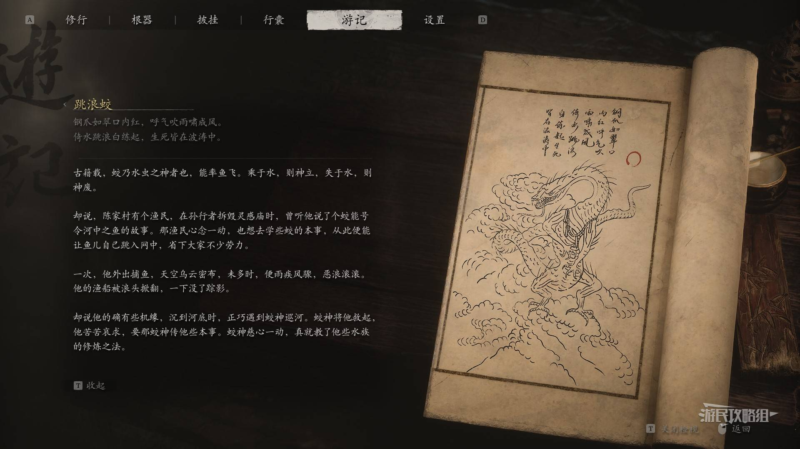

# 跳浪蛟

## 档案

- 影神图分类：头目
- 所属进程：第六回
- 影神图序号：140 / 203

## 故事导读

跳浪蛟 是 第六回 的头目级遭遇。影神图通常以一则短篇轶事说明其来历、执念或与其他角色的关系，可与战斗场景相互参照。

完整的影神图故事与遇见/解锁说明，请从下方来源页查阅。本卡采用导读和链接形式，未逐字转载原作图鉴文案。

## 来源与版权

- 图像与条目资料：[游民星空图鉴页面](https://www.gamersky.com/handbook/202409/1815206_140.shtml)
- 本地图片仅供个人学习、检索与非商业参考；《黑神话：悟空》及其角色、图像与文本权利归相关权利人所有。
